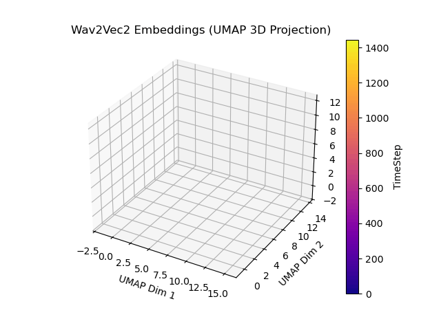
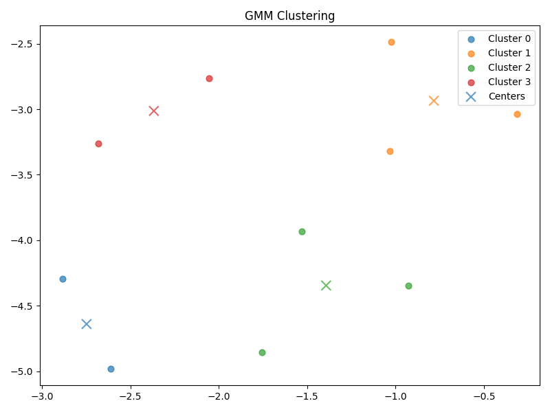

# Semantic Audio Feature Extraction with Machine Learning

This project uses machine learning to distill raw audio into meaningful feature representations, enabling semantic organization and exploration. The program uses unsupervised clustering with automatic cluster count estimation to group semantically-similar audio files. The program also returns the user's files in a clusters/ directory, with each file sorted into a cluster-n/ subdirectory.

The animation below depicts how the program sorts UMAP-reduced audio embeddings in time by semantic similarity.

The 2D plot below shows how a Gaussian Mixture Model (GMM) works with the Bayesian Information Criterion (BIC) to sort audio samples into a model with the best number of clusters.
