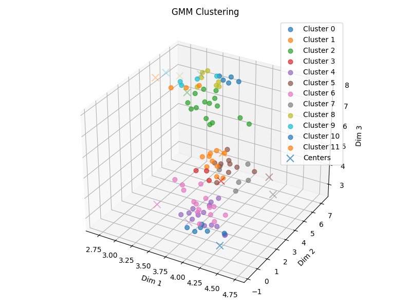
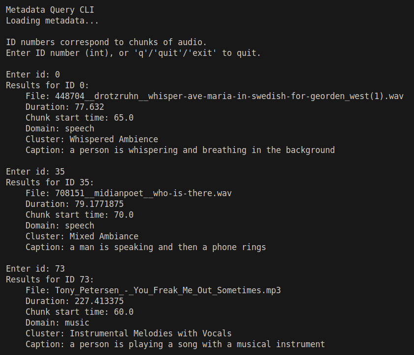

# Semantic Audio Feature Extraction with Machine Learning

This project uses machine learning to distill raw audio into meaningful feature representations, enabling semantic exploration and fast comparisons within large collections of audio. 

Embeddings are extracted from groups of audio files using the Wav2Vec2 base model, as fine-tuned by several projection heads trained specially by myself for this project. 

Files are also fed into the CoNeTTE model for audio captioning (developed by Etienne Labbe: https://github.com/Labbeti/conette-audio-captioning/tree/main). These captions will aid users in semantically-querying the audio files via a LangChain RAG. 

Other metadata, such as file duration and audio domain (music, speech, etc.), are stored in SQLite for easy retrieval; embedding vectors are stored in a FAISS (Facebook AI Similarity Search) index, so that new audio files can be compared to the machine-learned ones. 

Files can be grouped via unsupervised clustering with automatic cluster count estimation, or by forcing files into a user-specified number of clusters. Files can also be returned to the user in a clusters/ directory, with each file sorted into a cluster-n/ subdirectory.

When files are clustered, their captions are sent to Mistral, which summarizes the cluster based on the captions and assigns the cluster a generic title. Users will be able to take in at a glance how the program has decided to cluster their files and will be able to query the program about these files more easily, based on the text that has been assigned to them.

The animation below depicts how the program sorts UMAP-reduced audio embeddings in time by semantic similarity.

The 2D plot below shows how a Gaussian Mixture Model (GMM) works with the Bayesian Information Criterion (BIC) to sort audio samples into a model with the best number of clusters.

Users can force clustering for more noisy, high-level, and largely-populated sets of audio files. The plot below shows how 100 speech files were forced into 12 distinct clusters.

Metadata is stored in a FAISS index and SQLite database, which can be queried by ID numbers corresponding to chunked embeddings. The image below shows how various files have been sorted into domains, assigned clusters, given captions, and queried by ID number in a CLI tool.

